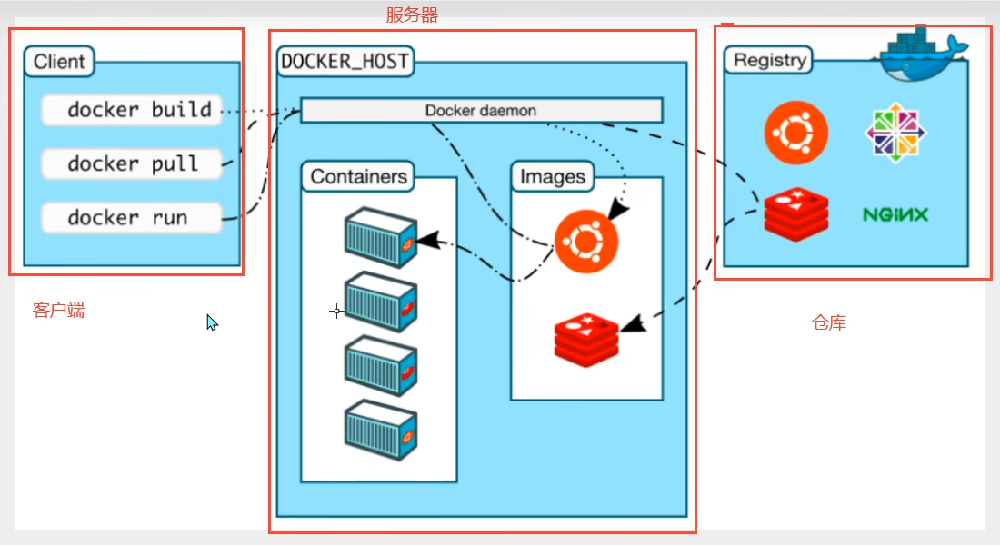
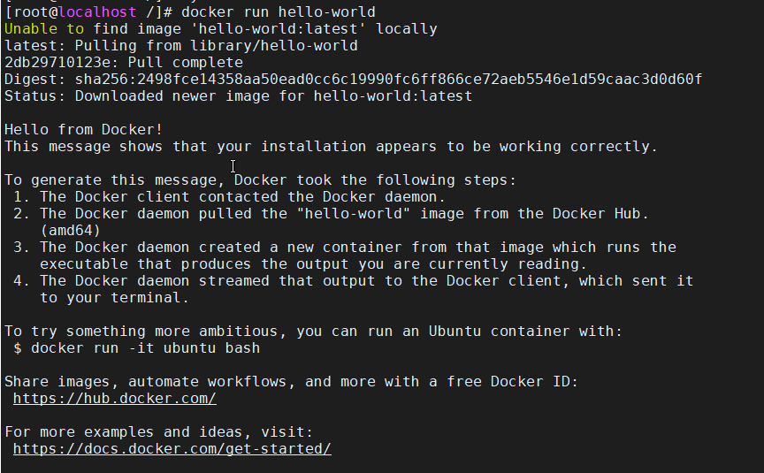
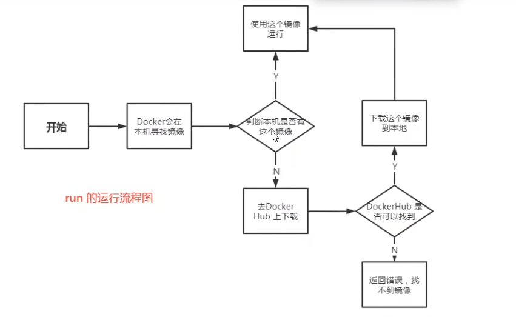
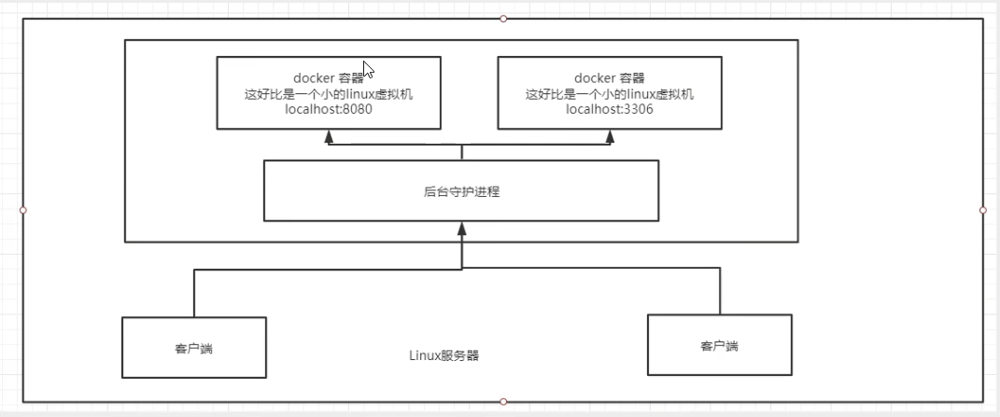
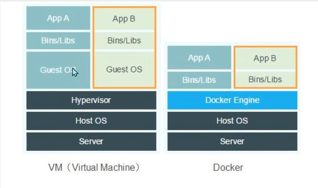

# Docker学习路线

- Docker概述
- Docker安装
- Docker命令
    - 镜像命令
    - 容器命令
    - 操作命名
    - ....
- Docker镜像
- 容器数据卷
- DockerFile
- Docker网络原理
- IDEA整合Docker
- （Docker高级）Docker Compose
- （Docker高级）Docker Swarm
- （Docker高级）CI\CD Jenkins

## Docker概述


>DevOps(开发+运维)
>
>Docker官方文档：https://docs.docker.com/desktop/get-started/

**应用更快速的交付和部署**
传统：一堆帮助文档，安装程序
Docker:打包镜像发布测试，一键运行
**更便捷的升级和扩缩容**
使用了Docker之后，我们部署应用就和搭积木一样！
项目打包为一个镜像，扩展服务器A!服务器B
**更简单的系统运维**
在容器化之后，我们的开发，测试环境都是高度一致的。
**更高效的计算资源利用**
Docker是内核级别的虚拟化，可以再一个物理机上可以运行很多的容器实例！服务器的性能可以被压榨到极致。


## Docker安装

### Docker的基本组成



**镜像（image）：**

docker镜像就好比是一个模板，可以通过这个模板来创建容器服务，tomcat镜像==>run==>tomcat(01容器（提供服务器），通过这个镜像可以创建多个容器（最终服务运行或者项目运行就是在容器中的）。

**容器（container）：**

Docker利用容器技术，独立运行一个或者一个组应用，通过镜像来创建的。
启动，停止，删除，基本命令！
目前就可以把这个容器理解为就是一个简易的liux系统

**仓库（repository）：**

仓库就是存放镜像的地方，仓库分为公有仓库和私有仓库！
Docker Hub(默认是国外的)，阿里云、腾讯云…都有容器服务器（配置镜像加速！）

### 安装Docker

```shell
#1、卸载旧的版本
yum remove docker
docker-client
docker-client-latest\
docker-common
docker-latest
docker-latest-logrotate
docker-logrotate\
docker-engine
#2、需要的安装包
yum install -y yum-utils
#3、设置镜像的仓库
yum-config-manager\
--add-repo\
https://download.docker.com/linux,/centos./docker-ce.repo#默认是从国外的！
yum-config-manager  --add-repo  http://mirrors.aliyun.com/docker-ce/linux/centos/docker-ce.repo
#推荐使用阿里云的，十分的快
#4、更新yum软件包索引
[root@kuangshen /]yum makecache fast
#5、安装dokcer相关的额docker-ce社区ee企业版
yum install docker-ce docker-ce-cli containerd.io
```


### 阿里云镜像加速

```shell
sudo mkdir -p /etc/docker
sudo tee /etc/docker/daemon.json <<-'EOF'
{
  "registry-mirrors": ["https://l75b8qvv.mirror.aliyuncs.com"]
}
EOF
sudo systemctl daemon-reload
sudo systemctl restart docker
```


### HelloWorldl流程






### 底层原理

**Docker是什么工作的？**
Docker是一个Client-Server结构的系统，Docker的守护进程运行在主机上。通过Socket/从客户端访问！
DockerServer接收到Docker-Client的指令，就会执行这个命令！




**Docker为什么比VM快？**

1、Docker有着比虚以机更少的抽象层。
2、docker利用的是宿主机的内核，vm需要是Guest OS。



所以说，新建一个容器的时候，docker不需要想虚拟机一样重新加载一个操作系统内核，避免引导。虚拟机是加载Guest OS,分钟级别的，而docker是利用宿主机的操作系统吗，省略了这个复杂的过程，秒级！


## Docker命令

>帮助文档地址：
>
>https://docs.docker.com/reference/

### 帮助命令

```shell
docker version #显示Docker的版本信息
docker info  #显示Docker的系统信息命令
docker 命令  --help #万能命令 
```

### 镜像命令

#### **docker images **

**查看本机上的所有镜像**

```shell
[root@localhost /]# docker images
REPOSITORY    TAG       IMAGE ID       CREATED         SIZE
hello-world   latest    feb5d9fea6a5   13 months ago   13.3kB

#解释
REPOSITORY	镜像的仓库源
TAG			镜像的标签
IMAGE ID	镜像的id
CREATED		镜像的创建时间
SIZE		镜像的大小
#可选项
-a,--a11	#列出所有镜像
-q,--quiet	#只显示镜像的id
```

#### **docker serach **

**搜搜镜像**

```shell
[root@localhost /]# docker search mysql
NAME                            DESCRIPTION                                     STARS     OFFICIAL                       AUTOMATED
mysql                           MySQL is a widely used, open-source relation…   13441     [OK]                          
mariadb                         MariaDB Server is a high performing open sou…   5124      [OK]                          
phpmyadmin                      phpMyAdmin - A web interface for MySQL and M…   678       [OK]   

#可选项
Usage:  docker search [OPTIONS] TERM
Search the Docker Hub for images
Options:
  -f, --filter filter   Filter output based on conditions provided
      --format string   Pretty-print search using a Go template
      --limit int       Max number of search results (default 25)
      --no-trunc        Don't truncate output
```

```shell
[root@localhost /]# docker search mysql -f=STARS=5000
NAME      DESCRIPTION                                     STARS     OFFICIAL   AUTOMATED
mysql     MySQL is a widely used, open-source relation…   13441     [OK]
mariadb   MariaDB Server is a high performing open sou…   5124      [OK]

```

#### **docker pull**

**下载镜像**

```shell
#下载镜像docker pul1镜像名[：tag]
[root@localhost /]# docker pull mysql
Using default tag: latest #不指定tag默认为最新的版本
latest: Pulling from library/mysql
72a69066d2fe: Pull complete # 分层下载，docker image的核心 联合文件系统
93619dbc5b36: Pull complete
99da31dd6142: Pull complete
626033c43d70: Pull complete
37d5d7efb64e: Pull complete
ac563158d721: Pull complete
d2ba16033dad: Pull complete
688ba7d5c01a: Pull complete
00e060b6d11d: Pull complete
1c04857f594f: Pull complete
4d7cfa90e6ea: Pull complete
e0431212d27d: Pull complete
Digest: sha256:e9027fe4d91c0153429607251656806cc784e914937271037f7738bd5b8e7709 #签名
Status: Downloaded newer image for mysql:latest
docker.io/library/mysql:latest # 真实地址

#这两个命令等价
docker pull mysql
docker pull docker.io/library/mysql:latest

#指定版本下载
[root@localhost /]# docker pull mysql:5.7
5.7: Pulling from library/mysql
72a69066d2fe: Already exists
93619dbc5b36: Already exists
99da31dd6142: Already exists
626033c43d70: Already exists
37d5d7efb64e: Already exists
ac563158d721: Already exists
d2ba16033dad: Already exists
0ceb82207cd7: Pull complete
37f2405cae96: Pull complete
e2482e017e53: Pull complete
70deed891d42: Pull complete
Digest: sha256:f2ad209efe9c67104167fc609cca6973c8422939491c9345270175a300419f94
Status: Downloaded newer image for mysql:5.7
docker.io/library/mysql:5.7

```

#### **docker rmi**

**删除镜像**

```shell
[root@localhost /]#docker rmi -f 镜像id  #删除指定的镜像
[root@localhost /]#docker rmi -f 镜像id1 镜像id2 镜像id3 镜像id4  #删除多个镜像
[root@localhost /]#docker rmi -f $(docker images-aq)  #删除全部的镜像

```


### 容器命令

**说明：我们有了镜像才可以创建容器，inux,下载一个centos镜像来测试学习**

```shell
docker pull centos
```


#### **新建容器并启动**

```shell
docker run[可选参数]image
#参数说明
--name="Name"	容器名字tomcat01,tomcat02,用来区分容器
-d				后台方式运行
-it				使用交互方式运行，进入容器查看内容
-p				指定容器的端口(以下四种方式)
    -p ip:主机端口：容器端口
    -p 主机端口：容器端口(常用)
    -p 容器端口
    容器端口
-P 				随机指定端口


#测试，启动并进入容器
[root@localhost /]# docker run -it centos /bin/bash
[root@8ca76f3fdc4e /]# ls 查看容器内的centos，是基础版本，很多命令不完善！
bin  dev  etc  home  lib  lib64  lost+found  media  mnt  opt  proc  root  run  sbin  srv  sys  tmp  usr  var
#从容器中退回主机
[root@8ca76f3fdc4e /]# exit
exit
[root@localhost /]# ls
bin  boot  dev  etc  home  lib  lib64  media  mnt  opt  proc  root  run  sbin  srv  sys  tmp  usr  var

```


#### **列出所有的运行的容器**

```shell
#docker ps 命令	
不加参数 #列出当前正在运行的容器
-a		-#列出当前正在运行的容器+带出历史运行过的容器
-n=?	#显示最近创建的容器
-q		#只显示容器的编号


[root@localhost /]# docker ps
CONTAINER ID   IMAGE     COMMAND   CREATED   STATUS    PORTS     NAMES
[root@localhost /]# docker ps -a
CONTAINER ID   IMAGE         COMMAND       CREATED         STATUS                       PORTS     NAMES
8ca76f3fdc4e   centos        "/bin/bash"   5 minutes ago   Exited (130) 3 minutes ago             epic_rosalind
34773002aa3e   hello-world   "/hello"      2 hours ago     Exited (0) 2 hours ago                 infallible_joliot
b4f296112e82   hello-world   "/hello"      4 hours ago     Exited (0) 4 hours ago                 strange_stonebraker

```


#### **退出容器**

```shell
exit      #直接容器停止并退出
Ctr1+P+Q  #容器不停止退出
```


#### **删除容器**

```shell
docker rm 容器id	#删除指定的容器，不能删除正在运行的容器，如果要强制删除rm-f
docker rm -f $(docker ps -aq)	#删除所有的容器
docker ps-a-q|xargs docker rm	#删除所有的容器
```


#### **启动和停止容器的操作**

```shell
docker start  容器id			#启动容器
docker restart  容器id		#重启容器
docker stop  容器id			#停止当前正在运行的容器
docker ki11  容器id			#强制停止当前容器
```


### 常用其他命令


#### dcoker服务的启动与关闭

```shell
systemctl start docker 		#启动docker服务
systemctl daemon-reload 	#重新加载某个服务的配置文件
```


#### 后台启动容器

```shell
#命令 docker run -d 镜像名
[root@kuangshen /]docker run -d centos
#问题:使用命令docker ps发现centos（该容器）停止了

#常见的坑：docker容器使用后台运行，就必须要有要一个前台进程，docker.发现没有应用，就会自动停止
#nginx,容器启动后，发现自己没有提供服务，就会立刻停止，就是没有程序了
```


#### 查看日志

```shell
```


