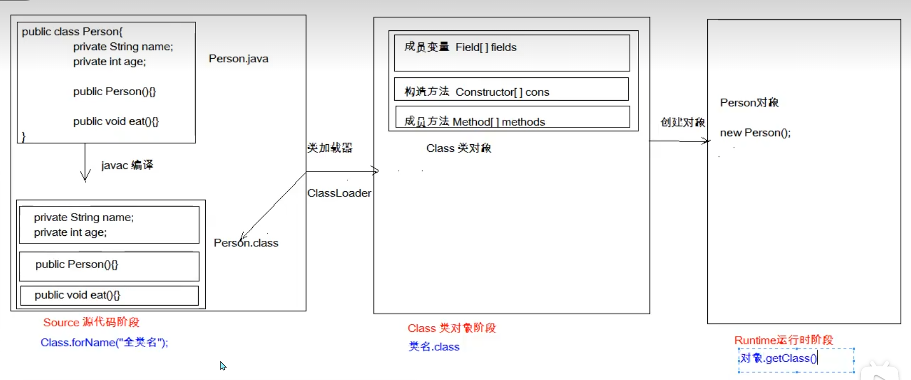

## 一、反射

> 反射，框架设计的灵魂！

**反射：将类的各个组成部分封装成其他对象，这就是反射机制！**

- 优点：
    - 可以在程序运行过程中，操作这些对象。
    - 可以解耦，提高程序的可扩展性。

获取CLass对象的方式：

1. Class.forName("全类名")：将字节码文件加载进内存，返回Class对象。

2. 类名.class：通过类名的class属性获取。

3. 对象.getClass()：通过对象的getClass()方法获取，getClass()方法定义在Object类中。

    

Class对象的常用功能：

1.获取成员变量		

- Field    getField(String name)  	：获取指定名称的public修饰的成员变量
- Field[]    getFields()    ：获取所有public修饰的成员变量

- Field    getDeclaredField(String name)  	：获取指定名称的成员变量，不考虑修饰符，需要暴力反射（setAccess方法）
- Field[]    getDeclaredFields()  	：获取所有的成员变量，不考虑修饰符

2.获取构造方法

- Constructor<T>   getConstructor(类<?>... parameterTypes)  
- Constructor<?>[]   getConstructors()  

- Constructor<T>     getDeclaredConstructor(类<?>... parameterTypes)  
- Constructor<?>[]     getDeclaredConstructors()  

3.获取成员方法

- Method     getMethod(String name, 类<?>... parameterTypes)  
- Method[]    getMethods()  

- Method    getDeclaredMethod(String name, 类<?>... parameterTypes)  
- Method[]    getDeclaredMethods()  

4.获取类名

- String    getName()  