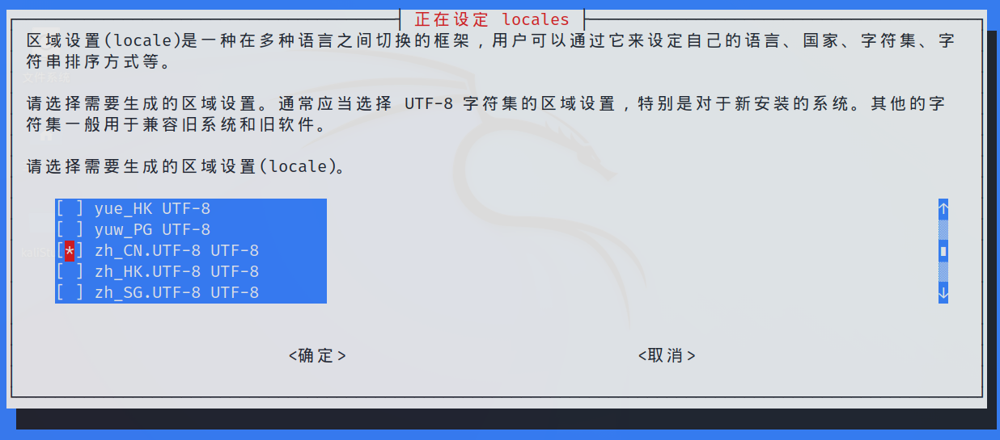
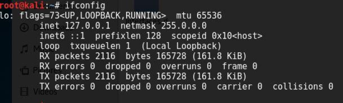
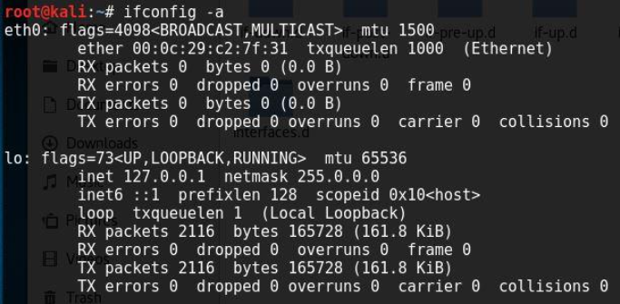
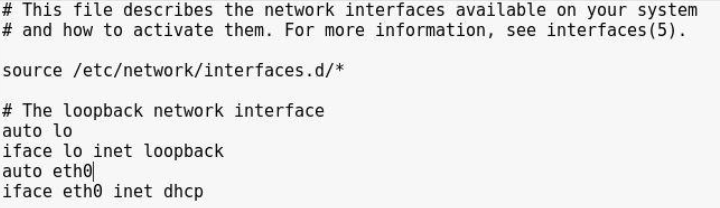

# 一、Kali系统操作

## 1.1、切换ROOT用户

输入命令：`sudo su`

## 1.2、修改语言

输入命令：`dpkg-reconfigure locales`，找到zh_CN.utf-8 按空格勾选，再回车下一步；出现zh_CN.UTF-8（箭头上下移动选择）回车。重启即可。




## 1.3、解决kali系统无法联网的情况

### （1）问题描述

有时候我们会突然发现我们的kali不能够正常上网，在终端使用ping 命令对其进行检查，显示网络不可达，

然后使用`ifconfig`，可以看到没有正在工作的网卡，只有localhost。



接着使用`ifconfig -a`，可以看到eth0这块网卡并没有丢失，只是暂停工作了而已。




### （2）解决方法

打开文件 /etc/network/interfaces，起初是没有最下面两行的，加上，格式和lo的差不多。

```vim
auto eth0
iface eth0 inet dhcp
```





最后，在terminal里执行 命令  `/etc/init.d/networking restart`   重启网络，使刚才的配置生效，

然后你再使用ping 命令发现现在可以正常上网了。

