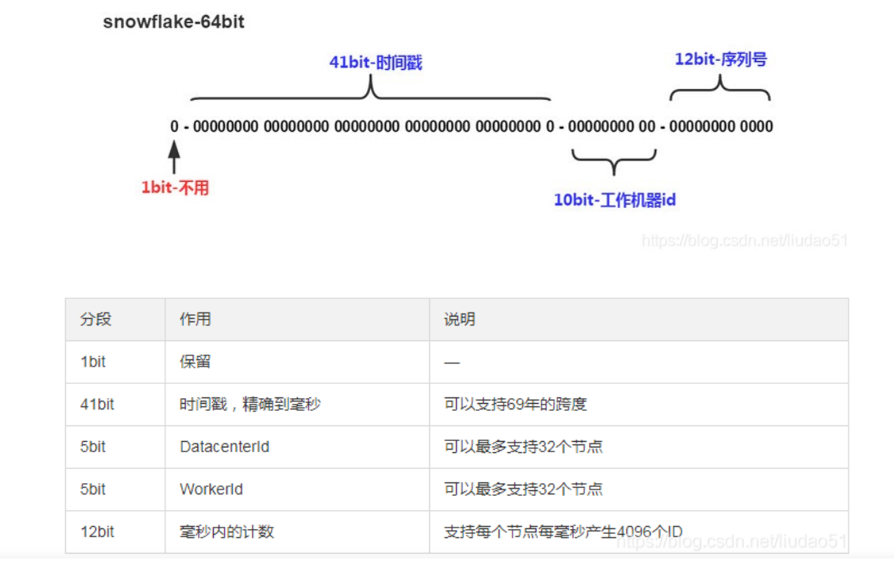

## 主键生成策略

> 分布式全局唯一ID生成策略：https://blog.csdn.net/liudao51/article/details/103007892/

```java
public enum IdType { 
    AUTO(0),//数据库id自增 
    NONE(1),//未设置主键 
    INPUT(2),//手动输入 
    ID_WORKER(3),//默认的全局唯一id 
    UUID(4),//全尾唯-id uuid 
    ID_WORKER_STR(5);//ID_WORKER 字符申表示法 
}
```

### 1、主键自增

(1)类的属性上加上`@TableId(type = IdType.AUTO)`

(2)数据库表的字段勾选自增

### 2、雪花算法

核心思想：把64-bit分别划分成多段，分开来标示机器、时间、某一并发序列等，从而使每台机器及同一机器生成的ID都是互不相同。



## 自动填充

### 1、数据库级别


### 2、代码级别

```java
@Data
@AllArgsConstructor
@NoArgsConstructor
public class User{
    @TableId(type = IdType.ID_WORKER)//默认的
    private Long id;
    private String name;
    private int age;
    private String email;

    //字段添加内容
    @TableField(fill = FieldFill.INSERT)
    private Date createTime;
    @TableField(fill = FieldFill.INSERT_UPDATE)
    private Date updateTime;

}

@Slf4j
@Component
public class myMetaObjectHandler implements MetaObjectHandler {
    @Override
    public void insertFill(MetaObject metaObject) {
        log.info("insert fill ...");
        this.setFieldValByName("createTime",new Date(),metaObject);
        this.setFieldValByName("updateTime",new Date(),metaObject);
    }

    @Override
    public void updateFill(MetaObject metaObject) {
        log.info("update fill ...");
        this.setFieldValByName("updateTime",new Date(),metaObject);
    }
}
```


## 乐观锁插件

1、注册配置类

```java
@Data
@AllArgsConstructor
@NoArgsConstructor
public class User{
    @TableId(type = IdType.ID_WORKER)//默认的
    private Long id;
    private String name;
    private int age;
    private String email;

    //乐观锁注解
    @Version
    private Integer version;
    
    //字段添加内容
    @TableField(fill = FieldFill.INSERT)
    private Date createTime;
    @TableField(fill = FieldFill.INSERT_UPDATE)
    private Date updateTime;

}

@Configuration
public class MybatisPlusConfig {

    @Bean
    public MybatisPlusInterceptor mybatisPlusInterceptor() {
        MybatisPlusInterceptor mybatisPlusInterceptor = new MybatisPlusInterceptor();
        mybatisPlusInterceptor.addInnerInterceptor(new OptimisticLockerInnerInterceptor());
        return mybatisPlusInterceptor;
    }
}

```

2、测试

```java
//测试乐观锁成功
    @Test
    public void testOptimisticLocker1(){

        //1、获取乐观锁version
        User user = userMapper.selectById(1L);
        //2、修改数据
        user.setName("yan");
        user.setAge(23);
        //3、执行插入
        userMapper.updateById(user);
    }
    //测试乐观锁大败！多线程下
    @Test
    public void testOptimisticLocker2(){
        User user = userMapper.selectById(1L);
        user.setName("yan1");
        user.setAge(23);

        //线程2：模拟多线程插队
        User user2 = userMapper.selectById(1L);
        user2.setName("yan2");
        user2.setAge(23);
        int i = userMapper.updateById(user2);
        System.out.println(i);

        /**
         * 结果：线程1插入失败
         * 如果没有线程2，线程1则或执行成功，覆盖线程2的修改数据
         */
        int i1 = userMapper.updateById(user);
        System.out.println(i1);
    }
```

