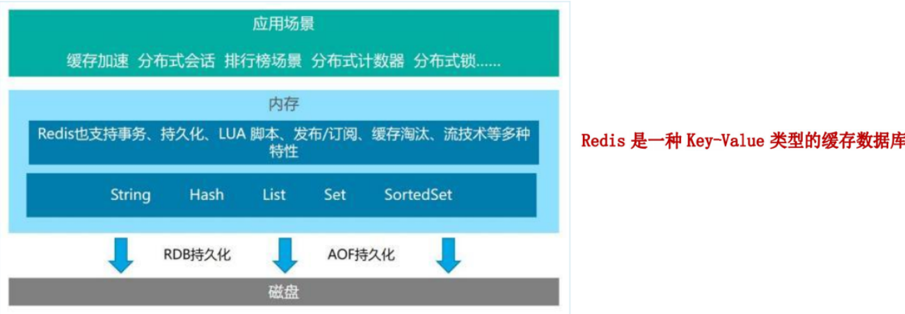
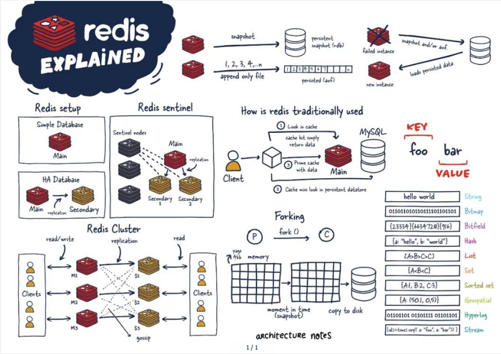
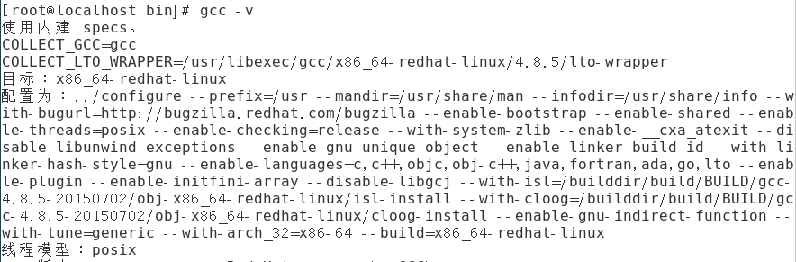
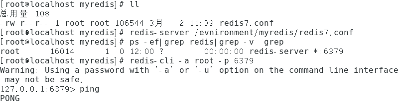

## 一、Redis概述

>版本：Redis7.0.0
>
>来源：[尚硅谷](https://space.bilibili.com/302417610)
>
>整理者：烟尘

*Remote Dictionary Server(远程字典服务)是完全开源的，使用ANSIC语言编写遵守BSD协议，是一个高性能的Key-Value数据库提供了丰富的数据结构，例如String、Hash、List、Set、SortedSet等等。数据是存在内存中的，同时Redis支持事务、持久化、LUA脚本、发布/订阅、缓存淘汰、流技术等多种功能，特性提供了主从模式、Redis Sentinel和Redis Cluster集群架构方案**

### 1、优势

- 性能极高-Redis能读的速度是110000次/秒，写的速度是81000次/秒。
- Redis数据类型丰富，不仅仅支持简单的key-value类型的数据，同时还提供Iist,set,Zset,hash等数据结构的存储。
- Redis:支持数据的持久化，可以将内存中的数据保持在磁盘中，重启的时候可以再次加载进行使用。
- Redis支持数据的备份，即master-slave模式的数据备份。

### 2、功能和应用

1.分布式缓存，挡在mysg数据库之前的带刀护卫D

2.内存存诸和持久化(RDB+AOF)，redis支持异步将内存中的数据写到硬盘上，同时不影响继续服务

3.高可用架构搭配

- 单机

- 主从

- 哨兵

- 集群

4.缓存穿透、击穿、雪崩

5.分布式锁

6.队列D

7.排行版+点赞

**一张图概括redis的主要功能**

## 二、Redis安装

>linux下安装Redis

（1）、查看虚拟机的版本位数

`getconf LONG_BIT`：返回64或32

（2）、查看环境

`gcc -v`：gcc编译环境

`yum -vy install gcc-c++`: 安装c++库环境

（3）、安装步骤

1. 下载获得redis-7.0.0.tar.gz后将它放入我们的Linux目录/opt

2. /opt目录下解压redis `tar -zxvf redis-7.0.0.tar.gz`

3. 进入目录

4. 在redis-7.0.0目录下执行make命令  `make && make install`

5. 查看默认安装目录：usr/ocal/bin

    > linux 下的/usr/local类似于Windows下的 C:\Programes Files

    - redis-benchmark：性能测试工具，服务启动后运行该命令，看看自己本子性能如何
    - redis-check-aof：修复有问题的AOF文件，rdb和aof后面讲
    - redis-check-rdb：修复有问题的dump.rdb文件
    - redis-cli：客户端，操作入口
    - redis-sentinel：redis集群使用
    - redis-server：Redis服务器启动命令

6. 将默认的redis.conf拷贝到自己定义好的一个路径下，比如/evnironment/myredis

7. 修改/evnironment/myredis下的redis.conf配置文件做为初始化配置

    > redis.conf配置文件，改完后确保生效，记得重启，记得重启

    -   默认daemonize no        改为 `daemonize yes`，将redis的后台运行启动。

    -   默认protected-mode yes   改为 `protected-mode no`，不再启动redis的保护模式。

    -   默认bind 127.0.0.1  改为直接注释掉(默认bind 127.0.0.1只能本机访问)或改成本机IP地址，否则影响远程IP连接。

    -   添加redis密码           改为 requirepass 你自己设置的密码。

8. 启动服务

    执行命令：`redis-server /evnironment/myredis/redis7.conf(配置文件的路径)`

9. 连接服务

     	`redis-cli -a root -p 6379`,如果`ping`后出现‘pong’则说明连接成功。

    

10. 关闭

    单实例关闭：`redis-cli -a rootshutdown`
    多实例关闭，指定端口关闭：`redis-cli -p 6379 shutdown`

## 三、Redis10大数据类型

