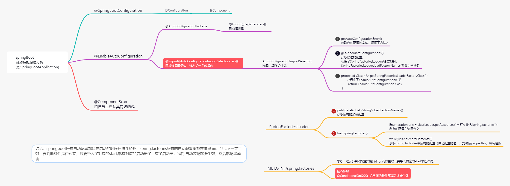

# SpringBoot

​	

### 1.1、主程序分析

```java
package com.yan;

import org.springframework.boot.SpringApplication;
import org.springframework.boot.autoconfigure.SpringBootApplication;

@SpringBootApplication
public class Springboot01HelloApplication {

    public static void main(String[] args) {
        SpringApplication.run(Springboot01HelloApplication.class, args);
    }

}
```


```java
@SpringBootApplication  :  标注这个类是一个SpringBoot应用

    @SpringBootConfiguration ：SpringBoot的配置
    	@Configuration: spring配置类
        	@Component ：这是一个spring的组件

    @EnableAutoConfiguration ：自动配置
         @AutoConfigurationPackage：自动配置包
             @Import({Registrar.class})：自动配置‘注册包’
         @Import({AutoConfigurationImportSelector.class}) ：自动配置导入选择


```


META-INF/spring.factories :自动配置的核心文件


### 1.2 、Run分析


### 1.3、自动装配（@SpringBootApplication）

思维导图地址：https://www.processon.com/mindmap/637f5619f346fb0848a812a3




### 1.4、yaml配置文件


#### 1、使用yaml为配置类注入值

```java
@Data
@AllArgsConstructor
@NoArgsConstructor
@Component
@ConfigurationProperties(prefix = "person")
@Validated//数据校验
public class Person {
    private String name;
    private List<Object> aihao;
    private Map<String,Object> maps;
    private Date birth;
    private Dog dog;
    @Email
    private String email;
}
//解决使用@ConfigurationProperties(prefix = "person")报红的问题，需加入依赖
<dependency>
     <groupId>org.springframework.boot</groupId>
     <artifactId>spring-boot-configuration-processor</artifactId>
     <optional>true</optional>
</dependency>
<!--SpringBoot较高版本使用JSR303校验需要导入依赖-->
<dependency>
    <groupId>org.springframework.boot</groupId>
    <artifactId>spring-boot-starter-validation</artifactId>
</dependency>
```


```yaml
person:
  name: yanchen
  aihao:
    - Java
    - Spring
    - Mysql
  maps: {k1: v1,k2: v2}
  birth: 2000/05/06
  dog:
    name: 二狗
    age: 3
```


