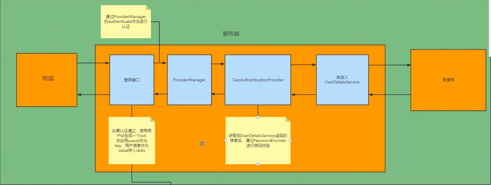

## 一、SpringSecurity完成流程

图中只展示了核心过滤器，其它的非核心过滤器并没有在图中展示。

**UsernamePasswordAuthenticationFilter**:负责处理我们在登陆页面填写了用户名密码后的登陆请求。入门案例的认证工作主要有它负责。
**ExceptionTranslationFilter**:处理过滤器链中抛出的任何AccessDeniedException和AuthenticationException。
**FilterSecuritylntercepto**r:负责权限校验的过滤器。

我们可以通过Debugi查看当前系统中SpringSecurityi过滤器链中有哪些过滤器及它们的顺序。

## 二、认证

### 思路分析

登录
