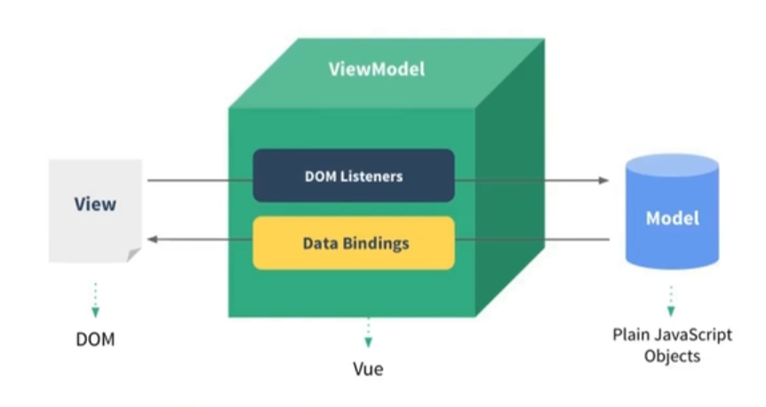
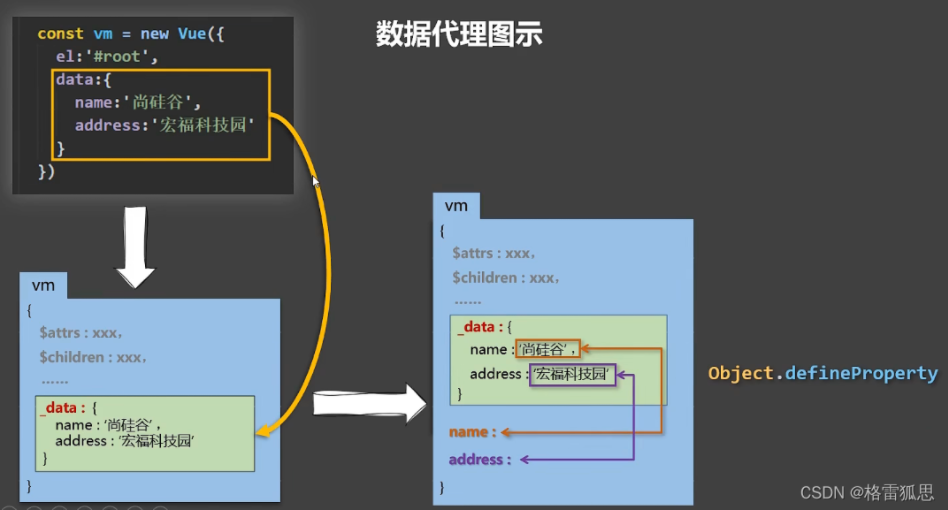
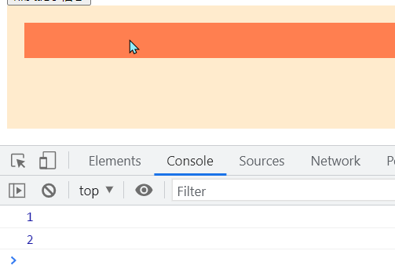
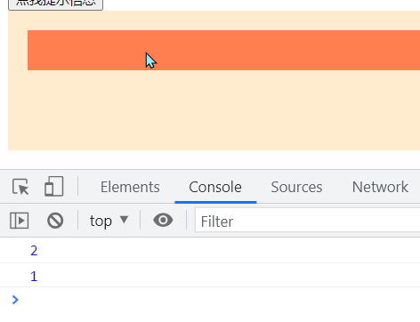
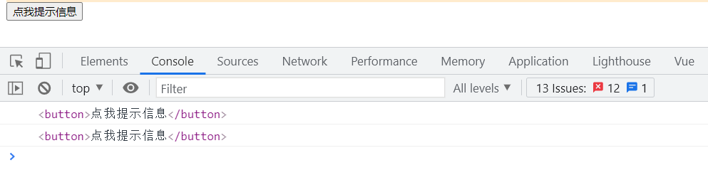
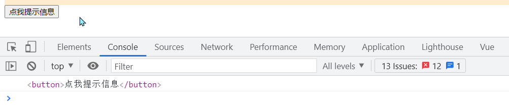
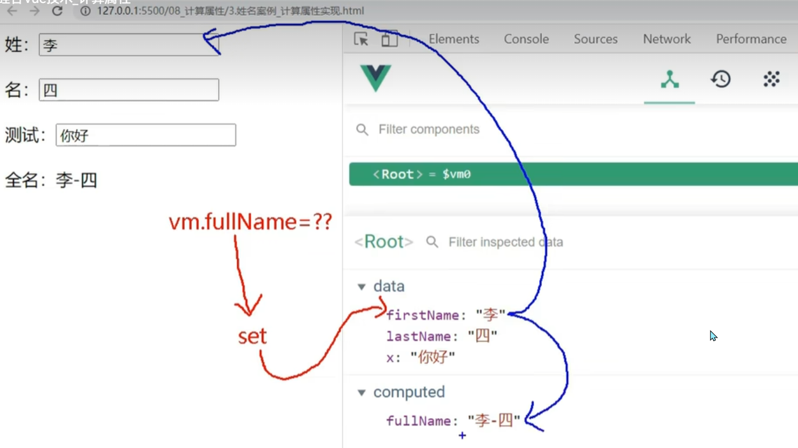

# 第一章  Vue核心

> 资料来源：尚硅谷张天禹老师
>
> 地址：[尚硅谷Vue全家桶](https://www.bilibili.com/video/BV1Zy4y1K7SH/)

## 1.1 初始Vue

- 想让Vue工作，就必须创建一个Vue实例，且要传入一个配置对象
- demo容器里的代码依然符合html规范，只不过混入了一些特殊的Vue语法
- demo容器里的代码被称为【Vue模板】
- Vue实例和容器是一一对应的
- 真实开发中只有一个Vue实例，并且会配合着组件一起使用
- {{xxx}}是Vue的语法：插值表达式，{{xxx}}可以读取到data中的所有属性
- 一旦data中的数据发生改变，那么页面中用到该数据的地方也会自动更新(Vue实现的响应式)

> 初始示例代码


```javascript
<!-- 准备好一个容器 -->
<div id="demo">
	<h1>Hello，{{name.toUpperCase()}}，{{address}}</h1>
</div>
<script type="text/javascript" >
	Vue.config.productionTip = false //阻止 vue 在启动时生成生产提示。
//创建Vue实例
new Vue({
	el:'#demo', //el用于指定当前Vue实例为哪个容器服务，值通常为css选择器字符串。
	data:{ //data中用于存储数据，数据供el所指定的容器去使用，值我们暂时先写成一个对象。
		name:'hello,world',
		address:'北京'
	}
});
</script>
```


## 1.2 Vue模板语法

Vue模板语法有2大类:

- 插值语法：


​			功能：用于解析标签体内容

​			写法：{{xxx}}，xxx是js表达式，且可以直接读取到data中的所有属性

- 指令语法:


​			功能：用于解析标签（包括：标签属性、标签体内容、绑定事件.....）

​			举例：v-bind:href="xxx" 或 简写为 :href="xxx"，xxx同样要写js表达式，且可以直接读取到data中的所有属性

```javascript
<div id="root">
	<h1>插值语法</h1>
	<h3>你好，{{name}}</h3>
	<hr/>
	<h1>指令语法</h1>
    <!-- 这里是展示被Vue指令绑定的属性，引号内写的是js表达式 -->
	<a :href="school.url.toUpperCase()" x="hello">点我去{{school.name}}学习1</a>
	<a :href="school.url" x="hello">点我去{{school.name}}学习2</a>
</div>

<script>
    new Vue({
		el:'#root',
		data:{
			name:'jack',
			school:{
				name:'百度',
				url:'http://www.baidu.com',
			}
        }
	})
</script>
```


## 1.3 数据绑定

Vue中有2种数据绑定的方式：

- 单向绑定(v-bind)：数据只能从data流向页面


- 双向绑定(v-model)：数据不仅能从data流向页面，还可以从页面流向data

> 1.双向绑定一般都应用在表单类元素上（如：input、select等）
>
> 2.v-model:value 可以简写为 v-model，因为v-model默认收集的就是value值

```javascript
<div id="root">
	<!-- 普通写法 单向数据绑定 -->
    单向数据绑定：<input type="text" v-bind:value="name"><br/>
    双向数据绑定：<input type="text" v-model:value="name"><br/>
    
    <!-- 简写 v-model:value 可以简写为 v-model，因为v-model默认收集的就是value值-->
    单向数据绑定：<input type="text" :value="name"><br/>
    双向数据绑定：<input type="text" v-model="name"><br/>
</div>

<script>
    new Vue({
		el:'#root',
		data:{
			name:'jack',
        }
	})
</script>
```

## 1.4 el与data的两种写法

el有2种写法

- new Vue时候配置el属性


- 先创建Vue实例，随后再通过vm.$mount('#root')指定el的值


```js
<script>
   	// 第一种 
	const vm = new Vue({
		el:'#root',
		data:{
			name:'jack',
        }
	})
    // 第二种
    vm.$mount('#root')
</script>
```

data有2种写法

- 对象式


- 函数式

    > 在组件中，data必须使用函数式


```js
<script>
    new Vue({
		el:'#root',
        // 第一种
		data:{
			name:'jack',
        }
		// 第二种
        data() {
            return {
                name: 'jack'
            }
        }
	})
</script>
```
## 1.5 Vue中的MVVM

- M：模型(Model) ：data中的数据
- V：视图(View) ：模板代码
- VM：视图模型(ViewModel)：Vue实例



## 1.6 Vue中的数据代理

>了解数据代理需要js的一些知识：Object.defineProperty()，属性标志，属性描述符，getter，setter。。。
>
>建议学习文章地址：
>
>https://zh.javascript.info/property-descriptors
>
>https://zh.javascript.info/property-accessors

**数据代理的原理：**

对象属性（properties），除 value 外，还有三个特殊的特性（attributes），也就是所谓的“标志”，其默认值均为`false`

- writable — 如果为 true，则值可以被修改，否则它是只可读的
- enumerable — 如果为 true，则表示是可以遍历的，可以在for.. .in Object.keys()中遍历出来
- configurable — 如果为 true，则此属性可以被删除，这些特性也可以被修改，否则不可以

```js
<script>
        let number = 18
        let person = {
            name: '张三',
            sex: '男',
        }

        Object.defineProperty(person, 'age', {
            // value: 18,
            // enumerable: true, //控制属性是否可以枚举，默认值是false
            // writable: true, //控制属性是否可以被修改，默认值是false
            // configurable: true, //控制属性是否可以被删除，默认值是false

            //当有人读取person的age属性时，get函数(getter)就会被调用，且返回值就是age的值
            get() {
                console.log('有人读取age属性了')
                return number
            },

            //当有人修改person的age属性时，set函数(setter)就会被调用，且会收到修改的具体值
            set(value) {
                console.log('有人修改了age属性，且值是', value)
                number = value
            }

        })

        // console.log(Object.keys(person))
        console.log(person)
    </script>
```





## 1.7 事件处理

### 1.7.1 事件的基本使用：

- 使用v-on:xxx 或 @xxx 绑定事件，其中xxx是事件名
- 事件的回调需要配置在methods对象中，最终会在vm上
- methods中配置的函数，都是被Vue所管理的函数，this的指向是vm 或 组件实例对象

```js
<!-- 准备好一个容器-->
<div id="root">
    <h2>欢迎来到{{name}}学习</h2>
    <!-- <button v-on:click="showInfo">点我提示信息</button> -->
    <button @click="showInfo1">点我提示信息1（不传参）</button>
    <!-- 主动传事件本身 -->
    <button @click="showInfo2($event,66)">点我提示信息2（传参）</button>
</div>
<script>
	const vm = new Vue({
        el:'#root',
        data:{
            name:'vue',
        },
        methods:{
            // 如果vue模板没有写event，会自动传 event 给函数
            showInfo1(event){
                // console.log(event.target.innerText)
                // console.log(this) //此处的this是vm
                alert('同学你好！')
            },
            showInfo2(event,number){
                console.log(event,number)
                // console.log(event.target.innerText)
                // console.log(this) //此处的this是vm
                alert('同学你好！！')
            }
        }
	});
</script>
```

### 1.7.2 事件修饰符

- `prevent`：阻止默认事件（常用）

- `stop`：阻止事件冒泡（常用）

- `once`：事件只触发一次（常用）

- `capture`:使用事件的捕获模式

    > 先进行捕获阶段，再进行冒泡阶段
    >
    > 默认是使用冒泡模式，也就是说在冒泡阶段就开始执行处理函数
    >
    > 若使用捕获模式后，在捕获阶段就开始执行处理函数

    ```html
    <!-- 事件捕获 -->
            <div class="out" @click="cap(1)">
                <div class="in" @click="cap(2)"></div>
            </div>
    ```

    

    ```html
    <!-- 事件捕获 -->
            <div class="out" @click.capture="cap(1)">
                <div class="in" @click="cap(2)"></div>
            </div>
    ```

    

- `self`:只有event.target是当前操作的元素是才触发事件

    ```js
    <div class="demo1" @click="showInfo">
        <button @click="showInfo">点我提示信息</button>
    </div>
    <!-- 点击按钮，此时会冒泡 -->
    ```

    

    ```js
    <div class="demo1" @click.self="showInfo">
        <button @click="showInfo">点我提示信息</button>
    </div>
    <!-- 点击按钮，div身上的事件并不会触发，因为此时的e.target是button而不是div -->
    ```

    

- `passive`:事件的默认行为立即执行，无需等待事件回调执行完毕

```js
<div id="app">
        <h2>欢迎来到{{name}}学习</h2>
        <!-- 阻止默认事件（常用） -->
        <a href="http://www.baidu.com" @click.prevent="showInfo">点我提示信息</a>
        <!-- 阻止事件冒泡（常用） -->
        <div class="demo1" @click="showInfo">
            <button @click.stop="showInfo">点我提示信息</button>
            <!-- 修饰符可以连续写 -->
            <!-- <a href="http://www.atguigu.com" @click.prevent.stop="showInfo">点我提示信息</a> -->
        </div>
        <!-- 事件只触发一次（常用） -->
        <button @click.once="showInfo">点我提示信息</button>

        <!-- 事件捕获 -->
        <div class="out" @click.capture="cap(1)">
            <div class="in" @click="cap(2)"></div>
        </div>
    </div>

    <script>
        new Vue({
            el: "#app",
            data() {
                return {
                    name: "烟尘"
                }
            },
            methods: {
                showInfo() {
                    alert("提示信息:你点击了")
                },
                cap(num) {
                    console.log(num);
                }
            }
        })
    </script>
```

### 1.7.3 键盘事件

键盘事件语法糖：@keydown，@keyup

1、Vue中常用的按键别名：

- 回车 => `enter`
- 删除 => `delete`(捕获“刷除”和“退格”键)
- 退出 => `esc`
- 空格 => `space`
- 换行 => `tab`（特殊，必须配合`@keydown`使用，因为tab按下后不等抬起就立即执行，所以不能使用`@keyup`）
- 上 => `up`
- 下 => `down`
- 左 => `1eft`
- 右 => `right`

2、Vue未提供别名的按键，可以使用按键原始的key值去绑定，但注意要转为kebab-case(短横线命名)

​		例如：CapsLock使用原生的用法时，必须是`@keyup.caps-lock`,而不是`@keyup.CapsLock`

3、系统修饰键（用法特殊）：`ctr1`、`alt`、`shift`、`meta(win)`

​		(1)、配合keyup使用：按下修饰健的同时，再按下其他健，随后释放其他键，事件才被触发。

​		(2)、配合keydown使用：正常触发事件。

4、也可以使用keyCode去指定具体的按键（不推荐）

5、Vue.config.keyCodes.自定义键名=键码，可以去定制按键别名


>​		<!-- 修饰符可以连写，例如先阻止默认行为，再阻止冒泡 -->
>​        <input type="text" @keyup.prevent.stop="showInfo" />
>​        <!-- 同时按下 Ctrl+y 才会触发 showInfo事件 -->
>​        <input type="text" @keyup.ctrl.y="showInfo" />

使用示例：

```js
<div id="app">
        <h1 class="name">{{name}}</h1>
        <input type="text" @keyup.enter="showInfo" />        
        <input type="text" @keyup.13="showInfo" /><!-- 不推荐使用 -->
</div>
<script>
        new Vue({
            el: "#app",
            data() {
                return {
                    name: "烟尘"
                }
            },
            methods: {
                showInfo(e) {
                    console.log(e.target.value);
                    
                },
                cap(num) {
                    console.log(num);
                }
            }
        })
    </script>
```

## 1.8 计算属性

> 组件模板应该只包含简单的表达式，复杂的表达式则应该重构为计算属性或方法。
>
> Vue官网 [风格指南](https://v2.cn.vuejs.org/v2/style-guide/) 中明确建议

计算属性：

1.定义：要用的属性不存在，要通过已有属性计算得来。

2.原理：底层借助了Objcet,defineproperty方法提供的getter和setter。

3.get函数什么时候执行？

​		(1).初次读取时会执行一次。

​		(2),当依赖的数据发生改变时会被再次调用。

4.优势：与methods实现相比，内部有缓存机制（复用），效率更高，调试方便。

5.备注：

​		(1).计算属性最终会出现在vm上，直接读取使用即可。

​		(2).如果计算属性要被修改，那必须写set函数去响应修改，且set中要引起计算时依懒的数据发生改变。

```js
<!--姓名案例-插值或methods实现-->
<body>
    <div id="app">
        性：<input type="text" v-model="xing" /><br>
        名：<input type="text" v-model="ming" /><br>
        全名(v-model):<span>{{xing}}-{{ming}}</span><br>
		/**
		fullName()触发函数执行，fullName 则会显示函数的源码。
        当data中的数据改变时，Vue的模板会自动检查模板中是否用到改变的数据，如果是则自动重现渲染模板，所以该案例中姓名每改变一次，fullName()就会执行一次。
        **/
        全名(methods):<span>{{fullName()}}</span>
    </div>
    <script>
        new Vue({
            el: "#app",
            data() {
                return {
                    xing: "烟",
                    ming: "尘"
                }
            },
            methods: {
                fullName() {
                    return this.xing + "-" + this.ming
                }
            }
        })
    </script>
</body>

```

```js
<!--姓名案例-计算属性实现-->
computed: {
    fullName: {
        //get有什么作用？当有人读取fu11Name时，get就会被调用，且返回值就作为ful1Name的值
        //get什么时候调用？1.初次读取fu11Name时。2.所依赖的数据发生变化时
        get() {
            console.log('get被调用了')
            return this.xing + "-" + this.ming
        },
        //set什么时候调用？当fullName被修改时。
        set(value) {
                console.log('set', value)
                const arr = value.split('-')
                this.firstName = arr[0]
                this.lastName = arr[1]
        }
    }
}
```




### 计算属性的简写

> 完整写法：同时考虑获取计算属性和修改计算属性的两种情况
>
> 简写：只考虑获取计算属性的情况下才可以简写

```js
computed: {
    fullName() {
        console.log('get被调用了')
        return this.xing + "-" + this.ming
    }
}
```


## 1.9 监视属性(侦听属性)

监视属性watch: 

1.当被监视的属性变化时，国调函数自动调用，进行相关操作 

2.监视的属性必须存在，才能进行监视！!

3.监视的两种写法：

​		(1).new Vue时传入watch配置 

​		(2).通过`vm.$watch(要监视的数据或属性，配置对象)`方法监视

**监视属性不仅可以监视`data`中的数据，还可以监视`computed`中属性。**


### 1.9.1 深度监视

深度监视： 

​		(1).Vue中的watch默认不监测对象内部值的改变（一层）。

​		(2).配置`deep:true`可以监测对象内部值改变（多层）。 

备注：

​		(1).Vue自身可以监测对象内部值的改变，但Vue提供的watch默认不可以！ 

​		(2).使用watch时根据数据的具体结构，决定是否采用深度监视。

```json
data: {
    ishot: true,
    numbers: {
        a: 1,
        b: {
            b1: 1
        }
    }
},
watch: {
    // 监视多级结构中某个属性的变化
    "numbers.a": {
        handler() {
            console.log("a被改变了");
        }
    },
    // 监视多级结构中所有属性的变化
    numbers: {
        /* 
        FALSE（默认）：会监视numbers本身发生变化，而不会监视其内部属性的变化
        TRUE：会监视到numbers.a或numbers.b.b1的改变
        */
        deep: true,
        handler(e) {
            console.log(e);
            console.log("numbers被改变了");
        }
    }
}
```


### 1.9.2 监视属性的简写

> 完整写法：包含 *handler*、*immediate* 、*deep* 等多个配置项的情况
>
> 简写：只包含 *handler*的情况下才可以简写

**Vue实例内部注册监视属性**

```js
watch: {
    //完整写法
    ishot: {
        //初始化时让handler调用一下
        immediate: true,
        //handler什么时候调用？当isHot发生改变时。
        handler(newValue, oldValue) {
            console.log('isHot被修改了', newValue, oldValue)
        }
    }
    //简写
    ishot(newValue, oldValue) {
        console.log('isHot被修改了', newValue, oldValue)
    }
}
```

**Vue实例外部注册监视属性**

```js
<script>
    let vm=new Vue({});
    //完整写法
    vm.$watch('ishot', {
        //初始化时让handler调用一下
        immediate: true,
        //handler什么时候调用？当isHot发生改变时。
        handler(newValue, oldValue) {
            console.log('isHot被修改了', newValue, oldValue)
        }
    });
	//简写
	vm.$watch('ishot', function(newValue, oldValue) {
       console.log('isHot被修改了', newValue, oldValue)
    });
</script>
```


### 1.9.3 watch对比computed

**computed 和 watch之间的区别：** 

1.computed能完成的功能，watch都可以完成。 

2.watch能完成的功能，computed不一定能完成，例如：watch可以进行异步操作。

 两个重要的小原则：

 1.所被Vue管理的函数，最好写成普通函数，这样this的指向才是vm 或 组件实例对象。

 2.所有不被Vue所管理的函数（定时器的回调函数、ajax的回调函数、Promise的回调函数等）,最好写成简头函数。 这样this的指向才是vm 或 组件实例对象。


# 第二章  Vue组件化编程


# 第三章  Vue脚手架


# 第四章  Vue中的Ajax


# 第五章  Vuex


# 第六章  Vue-router