# 一、版本控制

## 1.1 什么是版本控制？

版本控制（Revision control）是一种在开发的过程中用于管理我们对文件、目录或工程等内容的修改历史，方便查看更改历史记录，备份以便恢复以前的版本的软件工程技术。

- 实现跨区域多人协同开发

- 追踪和记载一个或者多个文件的历史记录

- 组织和保护你的源代码和文档

- 统计工作量

- 并行开发、提高开发效率

- 跟踪记录整个软件的开发过程

- 减轻开发人员的负担，节省时间，同时降低人为错误


简单说就是用于管理多人协同开发项目的技术。

没有进行版本控制或者版本控制本身缺乏正确的流程管理，在软件开发过程中将会引入很多问题，如软件代码的一致性、软件内容的冗余、软件过程的事物性、软件开发过程中的并发性、软件源代码的安全性，以及软件的整合等问题。


## 1.2 常见的版本控制工具

主流的版本控制器有如下这些：

- Git

- SVN（Subversion）

- CVS（Concurrent Versions System）

- VSS（Micorosoft Visual SourceSafe）

- TFS（Team Foundation Server）

- Visual Studio Online


版本控制产品非常的多（Perforce、Rational ClearCase、RCS（GNU Revision Control System）、Serena Dimention、SVK、BitKeeper、Monotone、Bazaar、Mercurial、SourceGear Vault），现在影响力最大且使用最广泛的是Git与SVN


## 1.3 版本控制分类

### 1.3.1 本地版本控制

记录文件每次的更新，可以对每个版本做一个快照，或是记录补丁文件，适合个人用，如RCS。

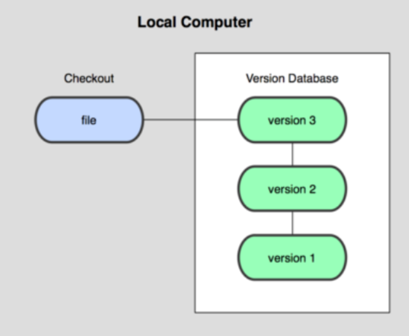

### 1.3.2 集中版本控制 (SVN)

所有的版本数据都保存在服务器上，协同开发者从服务器上同步更新或上传自己的修改。

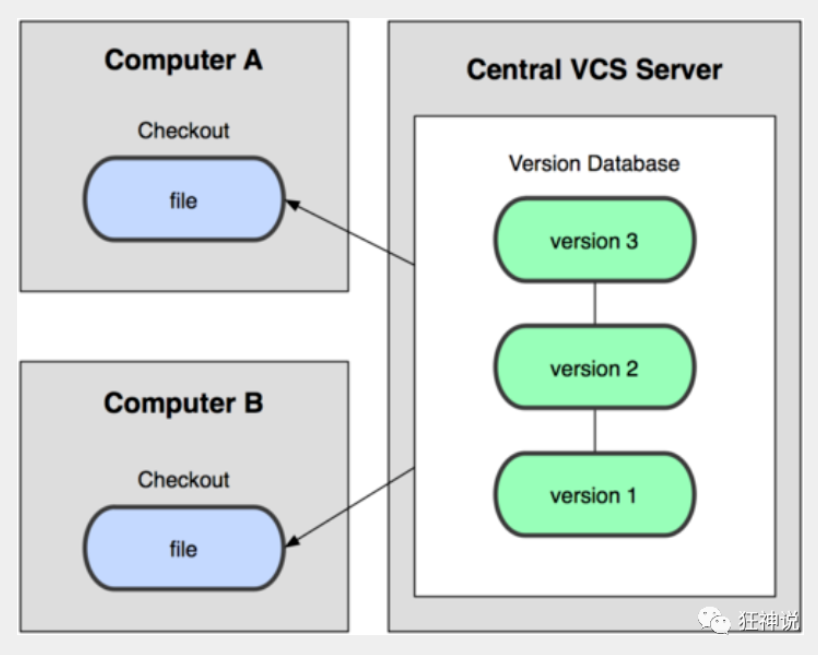

所有的版本数据都存在服务器上，用户的本地只有自己以前所同步的版本，如果不连网的话，用户就看不到历史版本，也无法切换版本验证问题，或在不同分支工作。而且，所有数据都保存在单一的服务器上，有很大的风险这个服务器会损坏，这样就会丢失所有的数据，当然可以定期备份。代表产品：SVN、CVS、VSS

### 1.3.3 分布式版本控制 (Git)

每个人都拥有全部的代码！安全隐患！

所有版本信息仓库全部同步到本地的每个用户，这样就可以在本地查看所有版本历史，可以离线在本地提交，只需在连网时push到相应的服务器或其他用户那里。由于每个用户那里保存的都是所有的版本数据，只要有一个用户的设备没有问题就可以恢复所有的数据，但这增加了本地存储空间的占用。

不会因为服务器损坏或者网络问题，造成不能工作的情况！

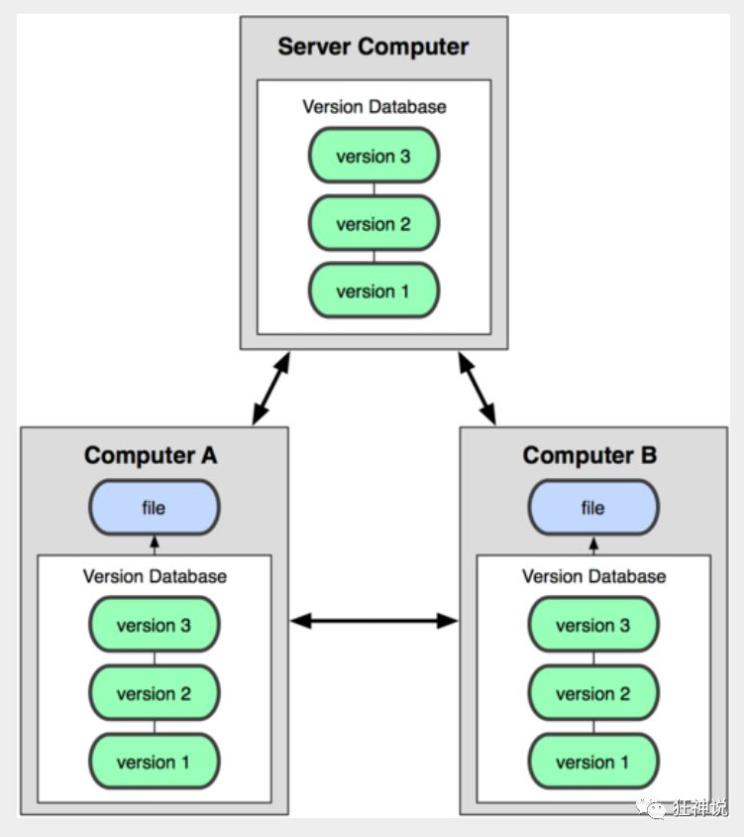


### 1.3.4 Git与SVN的主要区别

SVN是集中式版本控制系统，版本库是集中放在中央服务器的，而工作的时候，用的都是自己的电脑，所以首先要从中央服务器得到最新的版本，然后工作，完成工作后，需要把自己做完的活推送到中央服务器。集中式版本控制系统是必须联网才能工作，对网络带宽要求较高。

Git是分布式版本控制系统，没有中央服务器，每个人的电脑就是一个完整的版本库，工作的时候不需要联网了，因为版本都在自己电脑上。协同的方法是这样的：比如说自己在电脑上改了文件A，其他人也在电脑上改了文件A，这时，你们两之间只需把各自的修改推送给对方，就可以互相看到对方的修改了。Git可以直接看到更新了哪些代码和文件！


# 二、分布式版本控制——Git


## 2.1  Git的历史

同生活中的许多伟大事物一样，Git 诞生于一个极富纷争大举创新的年代。

Linux 内核开源项目有着为数众广的参与者。绝大多数的 Linux 内核维护工作都花在了提交补丁和保存归档的繁琐事务上(1991－2002年间)。到 2002 年，整个项目组开始启用一个专有的分布式版本控制系统 BitKeeper 来管理和维护代码。

Linux社区中存在很多的大佬！破解研究 BitKeeper ！

到了 2005 年，开发 BitKeeper 的商业公司同 Linux 内核开源社区的合作关系结束，他们收回了 Linux 内核社区免费使用 BitKeeper 的权力。这就迫使 Linux 开源社区(特别是 Linux 的缔造者 Linus Torvalds)基于使用 BitKeeper 时的经验教训，开发出自己的版本系统。（2周左右！） 也就是后来的 Git！

**Git是目前世界上最先进的分布式版本控制系统。**

Git是免费、开源的，最初Git是为辅助 Linux 内核开发的，来替代 BitKeeper！


Linux和Git之父李纳斯·托沃兹（Linus Benedic Torvalds）1969、芬兰


## 2.2 Git环境配置

### 2.2.1 常用的Linux命令

1）、cd : 改变目录。

2）、cd . . 回退到上一个目录，直接cd进入默认目录

3）、pwd : 显示当前所在的目录路径。

4）、ls(ll):  都是列出当前目录中的所有文件，只不过ll(两个ll)列出的内容更为详细。

5）、touch : 新建一个文件 如 touch index.js 就会在当前目录下新建一个index.js文件。

6）、rm:  删除一个文件, rm index.js 就会把index.js文件删除。

7）、mkdir:  新建一个目录,就是新建一个文件夹。

8）、rm -r :  删除一个文件夹, rm -r src 删除src目录

rm -rf / 切勿在Linux中尝试！删除电脑中全部文件！

9）、mv 移动文件, mv index.html src index.html 是我们要移动的文件, src 是目标文件夹,当然, 这样写,必须保证文件和目标文件夹在同一目录下。

10）、reset 重新初始化终端/清屏。

11）、clear 清屏。

12）、history 查看命令历史。

13）、help 帮助。

14）、exit 退出。

15）、#表示注释


### 2.2.2 Git配置

所有的配置文件，其实都保存在本地！

查看配置 ：`git config -l`

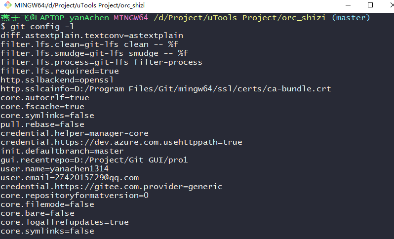

查看不同级别的配置文件：

```xml
#查看系统config
git config --system --list
　　
#查看当前用户（global）配置
git config --global  --list
```


Git相关的配置文件：

1）、Git\etc\gitconfig  ：Git 安装目录下的 gitconfig     --system 系统级

2）、C:\Users\Administrator\ .gitconfig    只适用于当前登录用户的配置  --global 全局

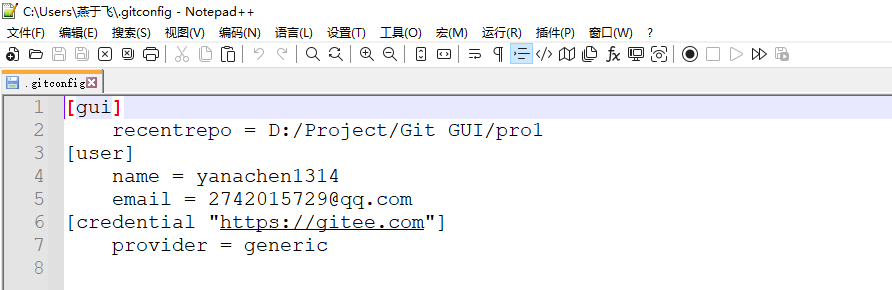

这里可以直接编辑配置文件，通过命令设置后会响应到这里。


### 2.2.3 设置用户名与邮箱（用户标识，必要）

当你安装Git后首先要做的事情是设置你的用户名称和e-mail地址。这是非常重要的，因为每次Git提交都会使用该信息。它被永远的嵌入到了你的提交中：

```js
git config --global user.name "yanachen"  #名称
git config --global user.email 2742015729@qq.com   #邮箱
```

只需要做一次这个设置，如果你传递了--global 选项，因为Git将总是会使用该信息来处理你在系统中所做的一切操作。如果你希望在一个特定的项目中使用不同的名称或e-mail地址，你可以在该项目中运行该命令而不要--global选项。总之--global为全局配置，不加为某个项目的特定配置。


## 2.3 Git基本理论（重要）

### 2.3.1 四个区域

Git本地有三个工作区域：工作目录（Working Directory）、暂存区(Stage/Index)、资源库(Repository或Git Directory)。

再加上远程的git仓库(Remote Directory)就可以分为四个工作区域。文件在这四个区域之间的转换关系如下：

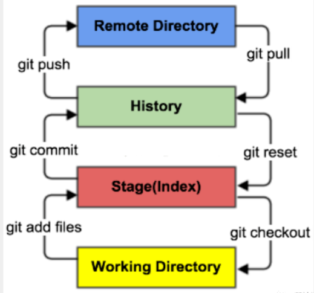

- Workspace：工作区，就是你平时存放项目代码的地方

- Index / Stage：暂存区，用于临时存放你的改动，事实上它只是一个文件，保存即将提交到文件列表信息

- Repository：仓库区（或本地仓库），就是安全存放数据的位置，这里面有你提交到所有版本的数据。其中HEAD指向最新放入仓库的版本

- Remote：远程仓库，托管代码的服务器，可以简单的认为是你项目组中的一台电脑用于远程数据交换

本地的三个区域确切的说应该是git仓库中HEAD指向的版本：

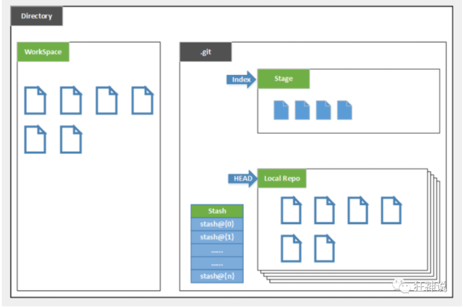


- Directory：使用Git管理的一个目录，也就是一个仓库，包含我们的工作空间和Git的管理空间。

- WorkSpace：需要通过Git进行版本控制的目录和文件，这些目录和文件组成了工作空间。

- .git：存放Git管理信息的目录，初始化仓库的时候自动创建。

- Index/Stage：暂存区，或者叫待提交更新区，在提交进入repo之前，我们可以把所有的更新放在暂存区。

- Local Repo：本地仓库，一个存放在本地的版本库；HEAD会只是当前的开发分支（branch）。

- Stash：隐藏，是一个工作状态保存栈，用于保存/恢复WorkSpace中的临时状态。


### 2.3.2 工作流程

git的工作流程一般是这样的：

１、在工作目录中添加、修改文件；

２、将需要进行版本管理的文件放入暂存区域；

３、将暂存区域的文件提交到git仓库。

因此，git管理的文件有三种状态：已修改（modified）,已暂存（staged）,已提交(committed)


## 2.4 Git项目搭建

### 2.4.1 创建工作目录与常用指令

工作目录（WorkSpace)一般就是你希望Git帮助你管理的文件夹，可以是你项目的目录，也可以是一个空目录，建议不要有中文。

日常使用只要记住下图6个命令：

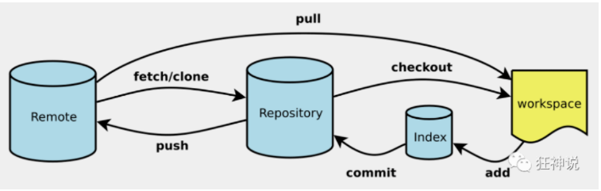


#### 

### 2.4.2 创建本地仓库

>  创建本地仓库的方法有两种：一种是创建全新的仓库，另一种是克隆远程仓库。

**（1）本地仓库搭建**

创建全新的仓库，需要用GIT管理的项目的根目录执行：

```js
#在当前目录新建一个Git代码库
$ git init
```

执行后可以看到，仅仅在项目目录多出了一个.git目录，关于版本等的所有信息都在这个目录里面。

**（2）克隆远程仓库**

另一种方式是克隆远程目录，由于是将远程服务器上的仓库完全镜像一份至本地！

```js
克隆一个项目和它的整个代码历史(版本信息)
$ git clone [url]  # https://gitee.com/kuangstudy/openclass.git
```


### 2.4.3 本地仓库连接远程仓库

1. 准备一个远程仓库（gitee或GitHub）并复制连接，和一个本地项目（非git项目）。

    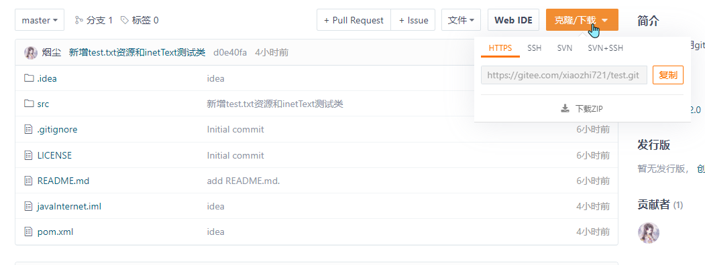

    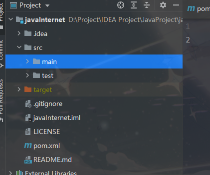

    

2. 初始化本地项目

    `git init`

3. 连接远程仓库

    `git remote add name https://gitee.com/xiaozhi721/test.git`

    `git remote add name https://github.com/yanachen1314/firstpro.git`

    "name"是自己为远程仓库起的别名，不写默认均为origin。

    > `git remote rm name`：删除连接的远程仓库。
    >
    > `git remote -v`：显示已经连接的所有远程仓库。

4. 拉取远程仓库的信息

    `git pull name master`

5. `git add .` 将所有已经修改的文件添加到缓存区

6. `git commit -m "message"`将缓存区的文件提交到本地仓库，并携带提交信息

7. `git push name`将本地仓库的文件推送到远程仓库(名为name的远程仓库，可能是Gitee或GitHub的)


## 2.5 Git文件操作

### 2.5.1 文件的四种状态

版本控制就是对文件的版本控制，要对文件进行修改、提交等操作，首先要知道文件当前在什么状态，不然可能会提交了现在还不想提交的文件，或者要提交的文件没提交上。

- Untracked: 未跟踪, 此文件在文件夹中, 但并没有加入到git库, 不参与版本控制. 通过`git add` 状态变为Staged。

- Unmodify: 文件已经入库, 未修改, 即版本库中的文件快照内容与文件夹中完全一致. 这种类型的文件有两种去处, 如果它被修改, 而变为Modified. 如果使用`git restore --staged filename`移出版本库, 则成为Untracked文件。

- Modified: 文件已修改, 仅仅是修改, 并没有进行其他的操作. 这个文件也有两个去处, 通过`git add`可进入暂存staged状态, 使用`git checkout` 则丢弃修改过, 返回到unmodify状态, 这个git checkout即从库中取出文件, 覆盖当前修改 !

- Staged: 暂存状态. 执行`git commit`则将修改同步到库中, 这时库中的文件和本地文件又变为一致, 文件为Unmodify状态. 执行`git reset HEAD filename`取消暂存, 文件状态为Modified。

### 2.5.2 查看文件状态

上面说文件有4种状态，通过如下命令可以查看到文件的状态：

```js
#查看指定文件状态
git status [filename]

#查看所有文件状态
git status

# git add .                  添加所有文件到暂存区
# git commit -m "消息内容"    提交暂存区中的内容到本地仓库 -m 提交信息
```


### 2.5.3 忽略文件

有些时候我们不想把某些文件纳入版本控制中，比如数据库文件，临时文件，设计文件等

在主目录下建立".gitignore"文件，此文件有如下规则：

1. 忽略文件中的空行或以井号（#）开始的行将会被忽略。

2. 可以使用Linux通配符。例如：星号（*）代表任意多个字符，问号（？）代表一个字符，方括号（[abc]）代表可选字符范围，大括号（{string1,string2,...}）代表可选的字符串等。

3. 如果名称的最前面有一个感叹号（!），表示例外规则，将不被忽略。

4. 如果名称的最前面是一个路径分隔符（/），表示要忽略的文件在此目录下，而子目录中的文件不忽略。

5. 如果名称的最后面是一个路径分隔符（/），表示要忽略的是此目录下该名称的子目录，而非文件（默认文件或目录都忽略）。

```js
#为注释
*.txt        #忽略所有 .txt结尾的文件,这样的话上传就不会被选中！
!lib.txt     #但lib.txt除外
/temp        #仅忽略项目根目录下的TODO文件,不包括其它目录temp
build/       #忽略build/目录下的所有文件
doc/*.txt    #会忽略 doc/notes.txt 但不包括 doc/server/arch.txt
```


## 2.6 Git分支

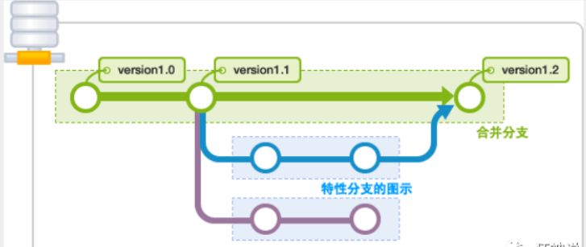

git分支中常用指令:

```java
# 列出所有本地分支
git branch

# 列出所有远程分支
git branch -r

# 新建一个分支，但依然停留在当前分支
git branch [branch-name]

# 新建一个分支，并切换到该分支
git checkout -b [branch]

# 合并指定分支到当前分支
$ git merge [branch]

# 删除分支
$ git branch -d [branch-name]

# 删除远程分支
$ git push origin --delete [branch-name]
$ git branch -dr [remote/branch]
```


